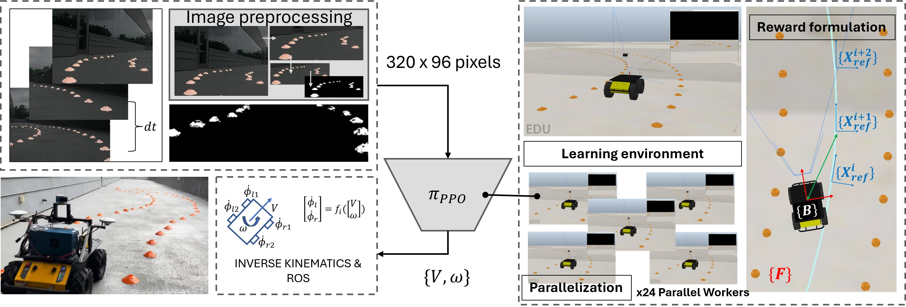
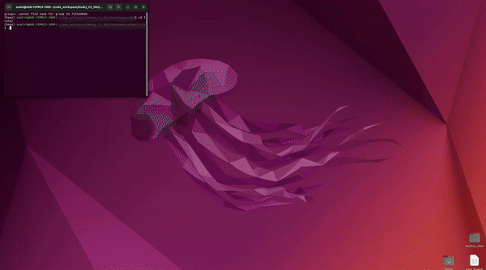
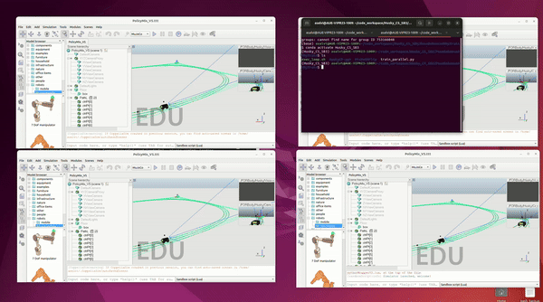

# Pose Enhanced Learning for Skid-steered visual navigation




## Installations
1. CoppeliaSim Robotics Simulator
- Downlodable at : https://coppeliarobotics.com/ 
- Ensure ZMQ package is installed for Python CoppeliaSim API (https://manual.coppeliarobotics.com/en/zmqRemoteApiOverview.htm) 

2. Clone the repository locally

3. Learning (StableBaselines3): Install the environment.yml file in your python environment. This installs SB3 with all the necessary python dependencies.

```
conda env update -f environment.yml
```

4. Register the learning environment such that SB3 identifies it as a python module. Environment packgaged as a python module in the folder : HuskyCP-gym

```
cd HuskyCP-gym/
pip install -e .
```

(pytorch versions may have to be updated as per user's Cuda requirements)


## Training and Evaluation

### Updating training variables

1. In the environment description file : 'HuskyCP-gym/huskyCP_gym/envs/huskyCP_gymPathFrenAW.py' update line 21 

```
sys.path.insert(0, "/home/asalvi/code_workspace/Husky_CS_SB3/train/") #Ensure correct path to your 'train' folder
```

2. In the environment description file : 'HuskyCP-gym/huskyCP_gym/envs/huskyCP_gymPathFrenAW.py' update line 105 to update local path to the folder MixPathFlip

```
path_loc = '/home/asalvi/code_workspace/Husky_CS_SB3/HuskyModels/MixPathFlip/'
```

3. In the training script 'train_parallel.py' Update lines 25 - 30
```
import sys
sys.path.insert(0, "/home/asalvi/code_workspace/Husky_CS_SB3/train/HuskyCP-gym") #Ensure correct path
import huskyCP_gym

tmp_path = "/home/asalvi/code_workspace/tmp/sb3_log/VisServo/test/" # Path to save logs
variant = 'test' # Save final model by this name

```

### Training and Saving

4. Launch parallel simulation instances (file : 'exec_loop.sh') (provided script launches 4 parallel instances. Can be scaled upto 50 (verified))
- Script ensures all instances are instantiated on different ports (CoppeliaSim requirement)
- Ensure sourcing correct location of CoppeliaSim installation directory

```
./exec_loop.sh
```
 

5. Once all instantces are launched, in another shell, run training script
```
python3 train_parallel.py
```



### Evaluation

6. For evaluation of trained models, navigate to the 'evaluation' directory. Within the evaltion directory, update the 'baseEval.py' file to change path to the saved model. Pretrained models used in the paper are availble for download at : https://drive.google.com/drive/u/1/folders/1uKjiQakRyRJekMSZcmaSau9RZih8Us6l 

```
model_path = '/home/asalvi/code_workspace/Husky_CS_SB3/Evaluation/EvalDump/Bsln/bslns2/bslnCnst.zip'
```
7. Once update, open a shell script to run the 'exec.sh' shell script to launch a single CoppeliaSim instant with the training environment.

8. In another shell, run the evaluation script:

```
python3 baseEval.py
```


### Deployment

Deploying the policy on the hardware required configuring the user hardware (associated ROS messages, libraries, etc.). Yet, an example deployment file has been provided in the /deployment directory. Ensure all the assoicated libraries and modules are available. Also ensure to change the namespaces of the ROS messages for the camera images and command velocities.


